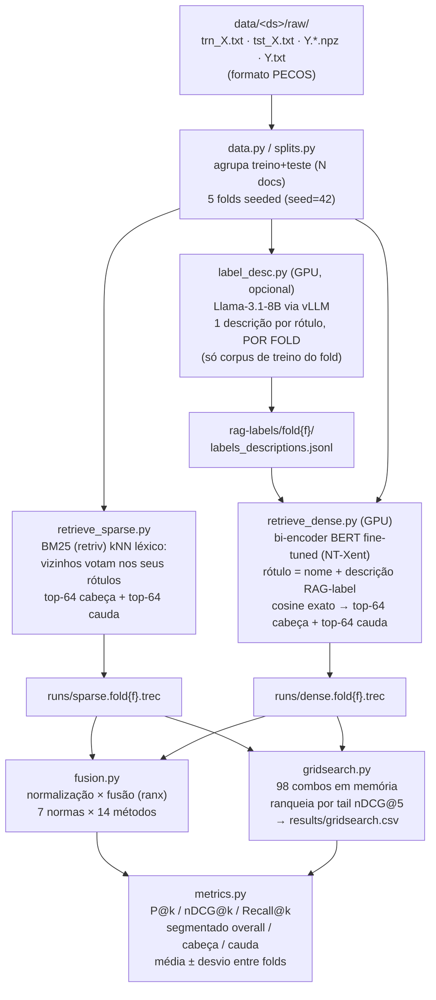

# Documentação Técnica — rank-fusion (XMTC)

> Gerada a partir do código real, dos arquivos de configuração e do histórico do git
> em 2026-06-12 (36 commits, 2026-06-05 → 2026-06-11). Afirmações sem respaldo no
> repositório são marcadas como "não encontrado no código".

## 1. Visão geral

O **rank-fusion** é um pipeline de pesquisa (mestrado em PLN/RI, UFMG) que trata
**classificação textual multi-rótulo extrema (XMTC)** como um problema de
**recuperação de informação**: o documento é a *query* e os rótulos são recuperados
e ranqueados. O projeto gera dois rankings base por documento — um **esparso**
(kNN léxico via BM25) e um **denso** (bi-encoder BERT *fine-tuned* com rótulos
representados por descrições geradas por LLM, as "RAG-labels") — e estuda
sistematicamente quais combinações de **algoritmo de fusão de rankings ×
estratégia de normalização de scores** (98 combinações: 7 normalizações × 14
fusões) melhoram a recuperação de **tail labels** (rótulos raros) sem prejudicar
os **head labels** (rótulos frequentes). O protocolo replica o artigo-base do
grupo (França et al. 2025, arXiv 2507.03761): 5-fold CV sobre o dataset agrupado,
métricas P@k/nDCG@k/Recall@k segmentadas cabeça/cauda (Pareto 80/20), baseline
CombMNZ+ZMUV. Primeiros resultados no Eurlex-4K replicam o achado do artigo:
fusão > denso > esparso, com ganho desproporcional na cauda (tail P@1 0,39→0,46;
tail nDCG@5 0,45→0,52 vs. o denso; +15–17%) sem perda na cabeça (CONTEXT.md,
"Estado atual").

## 2. Stack e dependências

**Linguagem:** Python 3.11.9 (TECH_STACK.md). Sem framework de aplicação — o
código é uma coleção de módulos CLI (`python -m src.<módulo>`) com `argparse` e
configs em `dataclass`.

| Dependência | Papel | Por que (motivo registrado no repo) |
|---|---|---|
| **retriv** ≥0.2.3 | Recuperador esparso BM25 | Substituiu o `bm25s` previsto originalmente para replicar fielmente o `SparseRetriever` do RAG-Fuse (código do autor do artigo-base): mesma tokenização (word/stemmer/stopwords) e BM25 k1=1.5, b=0.75 (TECH_STACK.md) |
| **ranx** ≥0.3.20 | Fusão + normalização + métricas clássicas | "Fonte da verdade" por guardrail do projeto (CLAUDE.md); vem como dependência do retriv |
| **torch / transformers** | Bi-encoder denso (BERT) | Porte do `DenseRetriever` do RAG-Fuse em torch puro, *sem* PyTorch-Lightning/Hydra/nmslib — decisão de simplicidade/reprodutibilidade (retrieve_dense.py, docstring) |
| **pytorch-metric-learning** ≥2.0 | Loss NT-Xent + miner | Réplica fiel da loss contrastiva do RAG-Fuse (`NTXentLoss` + `DotProductDistance` + porte do `RelevanceMiner`) |
| **vllm** | Serve Llama-3.1-8B-Instruct localmente | Geração das RAG-labels na GPU do lab (o RAG-Fuse usava AWS Bedrock; só o cliente muda — label_desc.py) |
| **xclib** (pyxclib, via git) | Métricas PSP@k/PSnDCG@k | Instalado na imagem Docker, mas **ainda não usado no código** (PSP é extensão a fazer; ver §Lacunas) |
| **numpy <2, scipy, tqdm** | Base numérica / leitura `.npz` | numpy fixado em 1.x: o xclib é compilado contra o ABI do numpy 1.26 e o faiss-cpu<1.9 também espera 1.x (requirements.txt) |
| **gdown** | Download (legado) | Tentativa de baixar via Google Drive; a fonte final foi HuggingFace via curl (TECH_STACK.md) |

**Explicitamente descartados:** `sentence-transformers`/`faiss` (encoder e
similaridade são feitos à mão, exatos); frameworks XMTC end-to-end
(AttentionXML, LightXML) — o foco é fusão, não treinar classificador
(TECH_STACK.md, "Não usar").

**Infra:** Dockerfile próprio sobre `pytorch/pytorch:2.1.0-cuda11.8-cudnn8-runtime`
(mesma versão torch/CUDA validada na máquina do lab). Experimentos pesados rodam
em GPU A100-80GB via Brev; a WSL local roda só os testes de CPU (CLAUDE.md).

## 3. Arquitetura

### Estrutura de pastas

```
rank-fusion/
├─ CLAUDE.md / CONTEXT.md / TECH_STACK.md / ARCHITECTURE.md / REQUIREMENTS.md   # docs-âncora
├─ Dockerfile, requirements.txt, pytest.ini
├─ scripts/
│  ├─ download_eurlex.sh        # Eurlex-4K (espelho HuggingFace thekop79)
│  ├─ download_wiki10.sh        # Wiki10-31K (PECOS xmc-base / archive.org)
│  ├─ download_xmc.sh           # genérico: qualquer slug do PECOS xmc-base
│  ├─ demo_*.py                 # demos em subconjunto (sparse, dense, label_desc)
│  └─ smoke_udlf.py             # smoke test da integração UDLF (em andamento)
├─ src/
│  ├─ data.py            # leitura PECOS + helpers multi-dataset (--dataset, --folds)
│  ├─ splits.py          # 5-fold CV sobre o dataset AGRUPADO (treino+teste)
│  ├─ retrieve_sparse.py # esparso: kNN léxico BM25 (retriv) → run TREC por fold
│  ├─ label_desc.py      # RAG-labels: descrição de rótulo via LLM (vLLM), por fold
│  ├─ prompts/           # label_desc_prompt.txt (verbatim do RAG-Fuse)
│  ├─ retrieve_dense.py  # denso: bi-encoder BERT fine-tuned → run TREC por fold
│  ├─ fusion.py          # wrappers ranx (7 norm × 14 fusão) + CombMNZ/RRF à mão
│  ├─ metrics.py         # P@k/nDCG@k/Recall@k segmentados overall/cabeça/cauda
│  └─ gridsearch.py      # varre as 98 combinações, ranqueia por métrica de cauda + CSV
├─ tests/                # ~100 testes; CPU por padrão (dublês), GPU/IO opt-in por marker
├─ docs/udlf-integration.md   # desenho da integração UDLF (não versionado ainda)
└─ data/<dataset>/{raw, runs, rag-labels, results}   # dados e artefatos (não versionados)
```

Observação: `ARCHITECTURE.md` menciona pastas `configs/` e `notebooks/`, mas elas
**não existem no working tree** — não encontrado no código (as configs hoje são
dataclasses com defaults + flags de CLI).

### Princípios estruturais

- **Estágios desacoplados por arquivos:** cada estágio lê e escreve arquivos em
  disco; "nada de estado global escondido" (ARCHITECTURE.md). O contrato entre
  estágios é o **formato TREC run** (`qid Q0 label_id rank score tag`).
- **Chave de rótulo** = `label_{índice_da_coluna}` (rótulos textuais do EuroVoc
  têm espaços e quebrariam o TREC).
- **`qid` = índice global** do documento no dataset agrupado (ordem
  [treino PECOS, teste PECOS]) — o gold de qualquer query é recuperável por
  `label_cols[qid]` em qualquer estágio.
- **Multi-dataset:** todos os CLIs aceitam `--dataset <nome>` (default
  `eurlex4k`); `data.apply_dataset` redireciona os caminhos da config para
  `data/<nome>/...` por convenção.
- **Imports lazy:** retriv, ranx, torch/transformers/pml e vllm são importados
  dentro das funções que os usam. A suíte de testes roda em CPU com dublês
  (`FakeSR`, `FakeLLM`, `FakeEncoder`); os testes reais são opt-in via markers
  pytest (`bm25`, `vllm`, `bert`).

### Fluxo principal



### Protocolo de avaliação

Fiel ao artigo-base: **5-fold CV sobre o dataset agrupado** (treino+teste do
PECOS juntos), não sobre o split fixo. Cada doc é query em exatamente 1 fold; os
4/5 restantes formam o corpus indexado/treinado daquele fold. O split
cabeça/cauda (Pareto: 20% mais frequentes = cabeça) é **global** (frequências
sobre os N docs), não por fold. A seed dos folds do artigo é desconhecida —
reproduz-se a *metodologia*, não os índices exatos (splits.py, docstring).

## 4. Decisões de design

Todas registradas no código/docs; trade-offs explicitados nos próprios arquivos.

1. **retriv em vez de bm25s** — fidelidade ao código do autor do baseline
   (mesma tokenização e hiperparâmetros do `SparseRetriever` do RAG-Fuse).
   Trade-off: herdou um bug grave de queries longas (segfault em kernel numba;
   ver §7).
2. **Porte do denso em torch+transformers puros**, sem PyTorch-Lightning/Hydra/
   nmslib do RAG-Fuse original. A busca ANN (HNSW) foi trocada por **similaridade
   cosine exata via matmul** — com ~4k rótulos é barato, exato e mais
   reprodutível (retrieve_dense.py). Trade-off assumido e depois pago: com
   670K rótulos (Amazon-670K) a matriz densa explodiria a memória, exigindo o
   scorer chunkado (commit `1d2f2ef`).
3. **CV sobre o dataset agrupado, com tudo "por fold" para evitar vazamento:**
   o fine-tuning do BERT e a geração das RAG-labels usam só o corpus de treino
   de cada fold — o doc-query nunca influencia a descrição do rótulo usado para
   recuperá-lo (label_desc.py, "Divergências conscientes").
4. **ranx como fonte da verdade + reimplementações à mão para validação:**
   CombMNZ e RRF foram reimplementados em Python puro e os testes conferem que
   a *ordem* produzida bate com a do ranx (fusion.py, tests/test_fusion.py) —
   guardrail de "demonstrar entendimento" do CLAUDE.md.
5. **Segmentação cabeça/cauda restringe ranking E gold** ao segmento (metrics.py).
   Decisão divergente do RAG-Fuse (que restringe só o ranking) — documentada
   explicitamente "por honestidade" na docstring.
6. **Fidelidade > velocidade nos hiperparâmetros:** batch_size do denso foi
   acelerado para 128 e depois **revertido para 32** (valor do RAG-Fuse) porque
   misturar batches entre folds confundia efeito-de-fold com
   efeito-de-hiperparâmetro (commit `2478a48`; ver §7). A regra derivada:
   acelerar paralelizando folds em GPUs (`--fold`/`--device`), nunca mexendo
   no batch.
7. **Resume-safe e idempotência em tudo que é caro:** runs por fold pulam folds
   com `.trec` existente; as RAG-labels são JSONL append-only com
   flush+fsync e RNG semeado por `(seed, fold, label)` — um run retomado produz
   exatamente o mesmo resultado de um run do zero (label_desc.py).
8. **Texto stemizado também no denso** (Eurlex): todos os espelhos do EURLex-4K
   distribuem texto stemizado/sem stopwords; usar o mesmo corpus mantém
   comparabilidade com o baseline. A degradação de embeddings fica registrada
   como ameaça à validade (REQUIREMENTS.md, "Casos de borda").
9. **"Gerar runs uma vez, iterar fusão offline":** a fusão é barata; o grid
   search carrega os runs base uma única vez e funde as 98 combinações em
   memória (gridsearch.py) — anti-padrão explícito do CLAUDE.md é recomputar
   recuperação a cada experimento.

## 5. Funcionalidades principais

| Funcionalidade | Arquivo(s) | Resumo |
|---|---|---|
| Carga de datasets PECOS + helpers multi-dataset | `src/data.py` | Lê `trn_X/tst_X.txt`, `Y.*.npz`, `Y.txt`; valida consistência; `dataset_paths`/`apply_dataset`/`add_dataset_arg`/`add_folds_arg` |
| 5-fold CV agrupado e reprodutível | `src/splits.py` | `load_pooled` (treino+teste, índices globais) + `make_folds` (permutação seeded, `np.array_split`) |
| Recuperador esparso (BM25 kNN) | `src/retrieve_sparse.py` | Indexa corpus do fold com retriv; vizinhos "votam" nos rótulos (agregação MAX, fiel ao paper); top-64 cabeça + top-64 cauda; dedup de query; `run_cv` resume-safe, `--fold`, `--query-batch-size`, índice isolado por fold |
| RAG-labels (descrições de rótulo via LLM) | `src/label_desc.py`, `src/prompts/label_desc_prompt.txt` | Prompt verbatim do RAG-Fuse com exemplos contrastivos; Llama-3.1-8B via vLLM (`LLM.chat`); JSONL por fold, append-only, resume idempotente |
| Recuperador denso (bi-encoder fine-tuned) | `src/retrieve_dense.py` | BERT + ConcatenatePooling (4 últimas camadas no [CLS], 3072-d, L2-norm); NT-Xent temp 0.07 + RelevanceMiner; AdamW 5e-5 + warmup, 5 épocas fp16; inferência cosine exata ou chunkada (>100K rótulos); RAG-labels opcionais (`--label-enhancement LLM|NONE`) |
| Fusão de rankings | `src/fusion.py` | Wrappers ranx para 7 normalizações × 14 fusões (6×10 do artigo + extras); alinhamento de qids entre runs; CombMNZ e RRF à mão validados contra o ranx |
| Avaliação segmentada | `src/metrics.py` | P@k/nDCG@k/Recall@k (k∈{1,5,10}) via ranx em 3 recortes (overall/head/tail); média±desvio entre folds; `run_report` compara sparse/dense/fundido |
| Grid search | `src/gridsearch.py` | 98 combos fundidos em memória, ranqueados por métrica de cauda (default tail nDCG@5); imprime top-N + posição do CombMNZ+ZMUV; CSV long-format; `--paper` restringe às 6×10 do artigo |
| Download de dados | `scripts/download_eurlex.sh`, `download_wiki10.sh`, `download_xmc.sh` | Eurlex via HuggingFace; demais via PECOS xmc-base (archive.org), com fetch robusto curl→wget→python |
| Integração UDLF (em andamento) | `docs/udlf-integration.md`, `scripts/smoke_udlf.py` | Fusão/re-ranking contextual não-supervisionado (CPRR/LHRR/RFE); adaptação bipartida por blocos proposta; smoke test pronto; `src/udlf_fusion.py` ainda não existe |
| Suíte de testes | `tests/` (~100 testes) | CPU por padrão com dublês (FakeSR/FakeLLM/FakeEncoder); BM25/vLLM/BERT reais opt-in via markers `bm25`/`vllm`/`bert` |

## 6. Trechos de código notáveis

1. **Dedup de termos da query para evitar segfault do retriv** —
   `src/retrieve_sparse.py:159-187` (`retrieve`/`_query_text`).
   O kernel BM25 do retriv (numba) monta uma lista de postings por *token* da
   query e a une com recursão de profundidade ≈ nº de termos / 2, numa worker
   thread de pilha pequena (teto medido: ~5 mil termos). Docs longos da EUR-Lex
   (até ~28 mil tokens) estouravam a pilha nativa — segfault que não se contorna
   por env var nem batch size. A solução, após uma primeira tentativa de
   truncamento que falhou, foi **deduplicar os tokens preservando a ordem**
   (q31: 28.301 → 1.842 termos): mantém todo o vocabulário do documento e só
   sacrifica o peso por repetição (query-TF binária) — trade-off documentado na
   própria docstring. Bela história de depuração de código de terceiros.

2. **RNG semeado por (seed, fold, rótulo) → resume = run do zero** —
   `src/label_desc.py:322-325` (`generate_fold`).
   `np.random.RandomState([cfg.seed, fold.fold_id, col])` faz a seleção de
   exemplos de cada rótulo ser independente da ordem de processamento: um run
   interrompido e retomado (resume via JSONL append-only) produz *exatamente* as
   mesmas descrições de um run contínuo. Combinado com a leitura tolerante a
   linha parcial (`load_descriptions`, linhas 253-274) e o flush+fsync por lote
   (`append_descriptions`), dá idempotência de verdade a um processo de horas de
   GPU. Padrão simples e reusável para reprodutibilidade em geração com LLM.

3. **Inferência chunkada com semântica idêntica à exata** —
   `src/retrieve_dense.py:202-259` (`rank_per_class_chunked`).
   No Amazon-670K a matriz de similaridade `[Nq, Nl]` (≈128K queries × 670K
   rótulos) não materializa (>300 GB). A versão chunkada sobe os embeddings de
   rótulo à GPU uma vez, processa queries em blocos de 1024 e usa `torch.topk`
   por classe (cabeça/cauda) — com resultado **idêntico** ao caminho numpy
   (mesma seleção top-k), ativada automaticamente acima de um threshold de
   vocabulário. É um trade de memória, não de fidelidade — distinção que importa
   num artigo.

4. **Guarda do scheduler contra steps pulados pelo GradScaler** —
   `src/retrieve_dense.py:502-510` (`train_fold`).
   Em fp16, o GradScaler pula o `optimizer.step()` quando detecta inf/NaN e
   reduz a escala; chamar `scheduler.step()` nesse caso desalinha o learning
   rate do warmup linear. O código compara a escala antes/depois
   (`scaler.get_scale() >= prev_scale`) e só avança o scheduler se o otimizador
   de fato passou. Detalhe não-trivial de treino em precisão mista que costuma
   passar despercebido (foi corrigido no commit `8ba62df`).

5. **Validação das implementações à mão contra o ranx** —
   `src/fusion.py:191-231` (`comb_mnz`, `rrf`) + `tests/test_fusion.py`.
   CombMNZ e RRF reimplementados em Python puro sobre dict-of-dicts, com testes
   que conferem igualdade de *ordem* com o `ranx.fuse`. Cumpre o guardrail
   metodológico ("implementar 2-3 algoritmos à mão só para demonstrar
   entendimento e validar contra o ranx") e dá confiança na biblioteca que roda
   as outras 96 combinações.

6. *(menção honrosa)* **Uso de `LLM.chat` em vez de `LLM.generate` no vLLM** —
   `src/label_desc.py:190-224` (`VLLMBackend`). Pré-renderizar o chat template e
   passar a string ao `generate` duplicaria o token BOS (bug vllm#9519), o que
   degrada silenciosamente a geração de modelos Llama — e contaminaria o insumo
   do recuperador denso. O comentário documenta o porquê, com referência ao bug.

## 7. Desafios e soluções (do histórico do git)

1. **Segfault do retriv com queries longas** (`5ee8cb1` → `06f7e76` → `0b04336`,
   2026-06-05). Primeira tentativa: truncar a query a 20K termos — "não resolveu
   de forma confiável: o kernel roda numa worker thread do numba cuja pilha só
   aguenta ~5 mil termos, e isso não se contorna por env var (OMP_STACKSIZE/
   ulimit) nem por query_batch_size=1 (testado: q19 com 7291 tokens ainda
   estoura)". Solução definitiva: dedup dos tokens (ver §6.1), registrada também
   nos docs-âncora.

2. **Conflito de ABI do numpy 2.x** (`6cee103`, `fac04d9`). O xclib é compilado
   contra o ABI do numpy 1.26 e o faiss-cpu<1.9 idem; numpy 2.x quebrava a
   importação ("numpy.core.multiarray failed to import"). Fix em duas camadas:
   pin `numpy<2` no requirements **e** no passo de build tools do Dockerfile
   (senão o pip resolvedor subia o numpy de novo durante o build do xclib). O
   Dockerfile também instala o xclib com `--no-build-isolation` porque ele exige
   Cython sem declará-lo como dependência de build (`4b9b48a`, `c0c2016`).

3. **CV não-homogêneo por mistura de hiperparâmetros** (`0f620a3` → `2478a48`).
   O batch_size do denso foi aumentado de 32→128 para acelerar; mas os folds 0-2
   já tinham sido treinados com 32 e os 3-4 ficaram com 128 — "confunde
   efeito-de-fold com efeito-de-hiperparâmetro; além disso batch 128 dá ~4x
   menos passos/época, subtreinando 3-4". A mistura **só foi pega pela curva de
   loss, não pelo log** — daí o fix incluir o log do config de treino em todo
   `run_cv` (auto-documentação) e a regra "paralelize folds em GPUs, não aumente
   o batch". Folds 3-4 foram retreinados. Caso exemplar de honestidade
   experimental.

4. **APIs novas do PyTorch em precisão mista** (`8ba62df`). Migração
   `torch.cuda.amp.GradScaler(...)` → `torch.amp.GradScaler("cuda", ...)` e a
   guarda scheduler/optimizer descrita em §6.4.

5. **Escalada para datasets grandes sem mudar a ciência** (série `146b145`,
   `6b92e22`, `089c0b3`, `a3b2175`, `55c9b70`, `1d2f2ef`, 2026-06-08→11). Cada
   commit ataca um gargalo de memória/robustez mantendo a partição e os
   resultados intactos: resume por fold em processo isolado (memória do retriv
   acumulava entre folds → OOM), `--query-batch-size` (pico do bsearch),
   índice retriv isolado por `index_tag` (folds em paralelo sem se
   sobrescreverem), seletor `--folds` (rodar 3 dos 5 folds por orçamento de
   compute *sem mudar a partição* k=5), leitura tolerante a encoding (Y.txt do
   Amazon-670K tem bytes não-UTF-8) e a inferência chunkada do denso.

6. **Infra de download instável** (`da87393`, `2918b38`). O Google Drive do
   AttentionXML falha no gdown (fonte trocada para HuggingFace); o container da
   Brev não tem curl (fallback curl→wget→python no fetch); por fim um script
   genérico para qualquer slug do PECOS xmc-base.

## 8. Linha do tempo da evolução

O histórico cobre 7 dias intensos (2026-06-05 a 2026-06-11), 36 commits.

- **2026-06-05 — Fundação e esparso.** Commit inicial já traz o pipeline
  Eurlex-4K com o recuperador esparso. No mesmo dia: Dockerfile próprio (com 4
  commits de luta contra o build do xclib/numpy) e a saga do segfault do retriv
  — truncamento, depois dedup definitivo, com a lição registrada nos docs.
- **2026-06-06 — O dia mais produtivo: CV, RAG-labels, denso e fusão.**
  Implementa o 5-fold CV (protocolo oficial do artigo); decisão de escopo
  formal (fine-tuning e RAG-labels entram); `label_desc.py` (RAG-labels via
  vLLM, por fold); o bi-encoder denso completo (porte do RAG-Fuse); e
  `fusion.py` com as 6×10 combinações do artigo + CombMNZ/RRF à mão validados,
  depois estendido com 4 fusões e 1 norma extras (→ 98 combos).
- **2026-06-07 — Correção de rota metodológica.** Reverte o batch 128→32 ao
  detectar o CV não-homogêneo; institui o log de config de treino.
- **2026-06-08 — Avaliação e generalização.** Métricas segmentadas
  cabeça/cauda; grid search das 98 combinações ranqueado por cauda; flag
  `--dataset` em todos os CLIs e início da escalada para o Wiki10-31K; primeiro
  endurecimento do esparso (resume-safe, `--fold`).
- **2026-06-09→11 — Robustez para datasets grandes.** Script de download
  genérico do xmc-base; controles de memória (`--query-batch-size`, índices
  isolados por fold para paralelismo); seletor `--folds` (3 dos 5 por
  orçamento); tolerância a encoding e inferência densa chunkada para o
  Amazon-670K.
- **Trabalho em andamento (não commitado):** `docs/udlf-integration.md` e
  `scripts/smoke_udlf.py` — desenho da integração com o framework UDLF
  (colaboração UNICAMP/UNESP) para comparar fusão clássica × fusão contextual.

## 9. Como rodar

### Localmente (CPU — testes e fusão/avaliação offline)

```bash
# Python 3.11.9 (pyenv). Instalar dependências:
pip install -r requirements.txt          # vllm só é necessário na GPU; xclib exige
                                         # Cython/pybind11 (ver Dockerfile se falhar)
python -m nltk.downloader punkt punkt_tab stopwords   # obrigatório p/ o retriv

# Baixar o dataset de validação:
bash scripts/download_eurlex.sh          # → data/eurlex4k/raw/
# (outros: bash scripts/download_xmc.sh wiki10-31k | amazoncat-13k | amazon-670k)

# Testes (CPU, com dublês; reais são opt-in):
python -m pytest                          # suíte mínima
python -m pytest -m bm25                  # BM25 real (retriv)

# Pipeline (a fusão/avaliação só precisa dos runs base já gerados):
python -m src.retrieve_sparse             # 5 folds → runs/sparse.fold{f}.trec
python -m src.fusion                      # CombMNZ+ZMUV nos 5 folds
python -m src.metrics                     # relatório sparse/dense/fundido segmentado
python -m src.gridsearch                  # 98 combos, ranking por tail nDCG@5 + CSV
# Flags comuns: --dataset <nome> · --folds 0,1,2 · --fold N · --no-resume
```

### Na GPU (Brev/Docker — treino do denso e RAG-labels)

```bash
docker build -t rank-fusion:latest .      # imagem própria (torch 2.1.0+cu118)

tmux new -s denso                         # no host (sobrevive à queda de SSH)
docker run -it --rm --gpus '"device=3"' --cpus="16" --memory="32g" \
  -v /data/dupla_xmtc:/workspace -w /workspace/rank-fusion rank-fusion:latest bash

# dentro do container (efêmero):
pip install pytorch-metric-learning "numpy<2"
git pull
python -m src.label_desc                  # RAG-labels por fold (vLLM + Llama-3.1-8B)
python -m src.retrieve_dense              # treina/infere o denso por fold
python -m src.retrieve_dense --fold 4 --device cuda:1   # paralelizar folds em GPUs
```

O modelo `meta-llama/Llama-3.1-8B-Instruct` é gated no HuggingFace; para testar
sem aprovação: `export LABEL_DESC_MODEL=NousResearch/Meta-Llama-3.1-8B-Instruct`
(label_desc.py).

## Lacunas e pontos a esclarecer

1. **PSP@k/PSnDCG@k não implementadas** — são "obrigatórias" em
   REQUIREMENTS.md e o xclib está instalado na imagem, mas nenhum código as usa
   ainda (metrics.py as marca como "extensão futura"). Para o artigo, decidir se
   entram ou se o relato fica só com a segmentação cabeça/cauda do artigo-base.
2. **Pastas `configs/` e `notebooks/`** aparecem em ARCHITECTURE.md mas não
   existem; o guardrail "salvar configs de cada experimento... não hard-codear
   caminhos fora de configs/" não tem mecanismo no código além dos dataclasses.
   Atualizar o doc ou criar a pasta?
3. **Números experimentais:** os resultados citados (tail P@1 0,39→0,46 etc.)
   vêm de CONTEXT.md; o CSV do grid search (`data/.../results/gridsearch.csv`)
   não está versionado e não há registro do estado dos runs em Wiki10/AmazonCat/
   Amazon-670K no repositório — não encontrado no código. Para o artigo, vale
   consolidar os resultados num lugar versionado.
4. **Pesos do denso não são salvos** (`retrieve_dense.py` treina e descarta o
   encoder após a inferência) — relevante para a opção C da integração UDLF
   (embeddings de rótulo) e para reprodutibilidade de análises post-hoc.
5. **UDLF:** o desenho (docs/udlf-integration.md) e o smoke test existem mas não
   estão commitados, e `src/udlf_fusion.py` ainda não existe. A "decisão em
   aberto" sobre a fonte do ranking rótulo→rótulo (co-ocorrência vs. BM25 vs.
   embeddings) precisa ser tomada.
6. **Sem README.md nem LICENSE** na raiz (a documentação vive nos arquivos-âncora
   CLAUDE/CONTEXT/TECH_STACK/ARCHITECTURE/REQUIREMENTS) — ok para repo de
   pesquisa privado, mas vale decidir antes de tornar público junto ao artigo.
7. **Reprodutibilidade aproximada das RAG-labels:** a docstring de label_desc.py
   registra que geração com temperature>0 é só aproximadamente reprodutível
   entre versões de vLLM/hardware mesmo com seed — vale uma frase de limitação
   no artigo.
